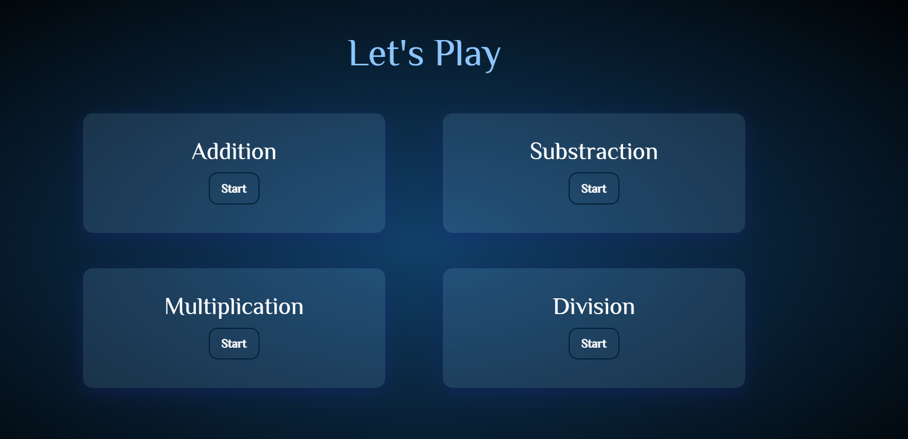
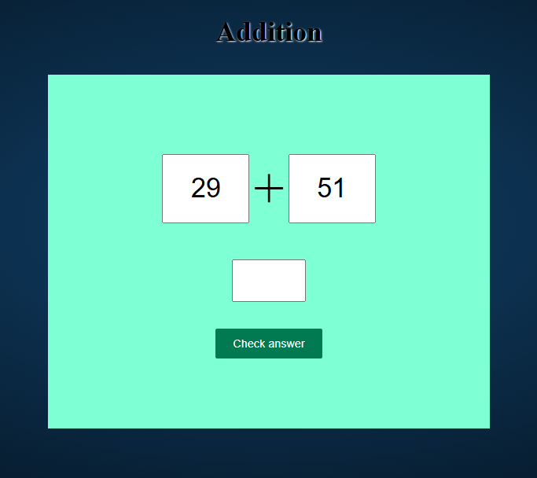
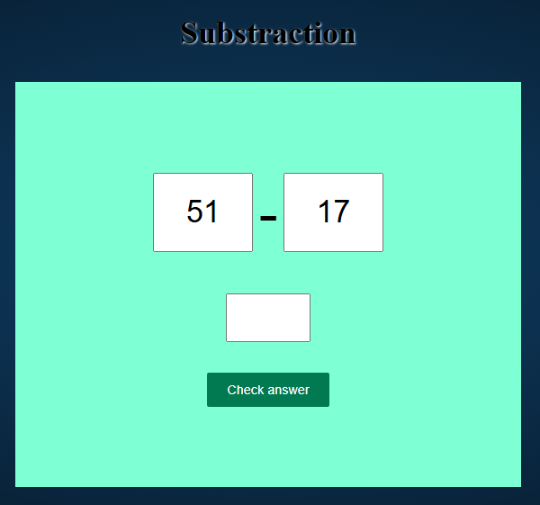
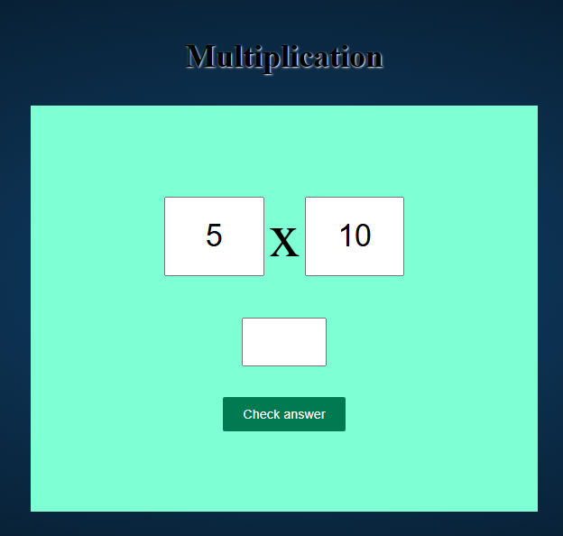
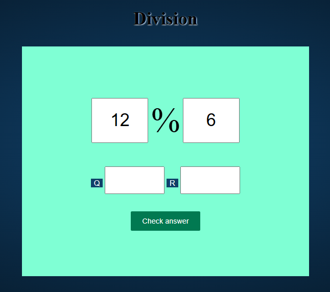

# 🎯 Let's Practice - Math Quiz Web App

## 📝 Project Overview
This web app is designed for kids to **practice basic arithmetic operations** like **addition, subtraction, multiplication, and division** in an interactive and fun way.

## 💻 Tech Stack


## 🚀 How to Get Started

1. **Clone the repository**
   ```bash
   git clone https://github.com/yashpatil-1/Calculation-Speed-Test.git
   cd Calculation-Speed-Test
   ```
2. **Open the `index.html` file** in a web browser.
3. Start practicing arithmetic calculations.

## 🕹️ How to Play
1. Select the **operation** you want to practice (Addition, Subtraction, Multiplication, Division).
2. **Calculate** and enter your answer in the input box.
3. Click on **"Check Answer"** to verify your answer.
4. An **alert** will display whether your answer is correct or incorrect.
5. Click **OK** to continue the quiz.

## 📸 Screenshots









## 🤝 Contributing
If you'd like to contribute, feel free to **fork** the repository and submit a **pull request**.

## 📜 License
This project is licensed under the **MIT License**.

## 📞 Contact
For any inquiries, reach out via **[workwithme.3215@gmail.com](mailto:workwithme.3215@gmail.com)** or visit my **[GitHub Profile](https://github.com/yashpatil-1)**.

---
Enjoy practicing math with **"Let's Practice"**! 🧮🚀
